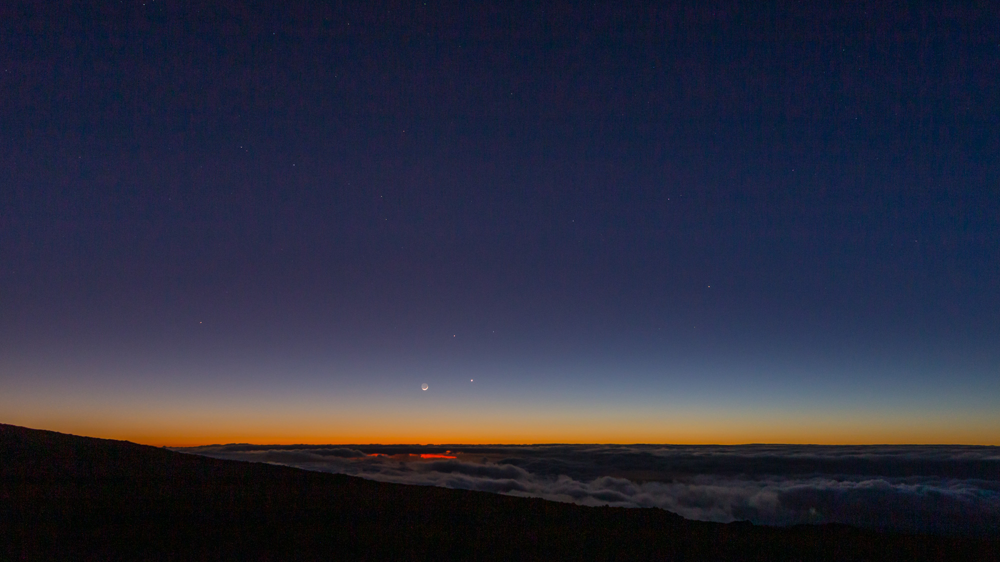

Title: A Trio of May Observing Sessions
Date: 2020-05-24
Author: Josh Walawender
Header_Cover: images/6D-7894.jpg
Category: Observing Reports
Tags: Mauna Loa, Astronomy, Observing Reports
Slug: may-observing-2020

I managed to get out for three nights of observing during this dark of the moon period all using my SVX152 on the Rowan AZ-100.

# May 15

A nice dark moon night spent at the parking lot at the end of the Mauna Loa Access Road.  Nice conditions, but occasional wind shake limited high power work.

I caught a pair of comets early in the evening: PANSTARRS (C/2017 T2) and ATLAS (C/2019 Y1).  Then, I continued working through the list of objects in Hydra which I'd worked on in April, finally finishing the list of 60 objects.  

The highlight of the night was finding SN 2020ifo in M61. This was very faint and I didn't expect to see in in "only" a 6 inch telescope, but I did tease it out by finding a star that wasn't on the sky chart and verified the position later against catalogs. Also tried to pick up some faint stars just to see how deep I could go. I visually got a lot deeper than I expected bagging a couple of mag 14.X stars and the SN was somewhere in that range as well

# May 18

This was a short solo session at a pullout below the top of the Mauna Loa Access Road.  Similar to how I'd built lists of deep sky objects (DSOs) in Hydra for previous observing sessions, this time I started on a list of DSOs in Crater and Corvus.  These are smaller constellations, so it was much shorter list (18 objects) than the list for Hydra (60 objects) and I finished it in this session.  I finished up with a few bright favorites that were rising (the Ring Nebula) and packed up before it got too late.

# May 23

May 23 was a good session for me.  Some of the WHAC members were thinking of heading to the Ka'ohe site and it turns out that heading for the Mauna Loa access road was a good call as it allowed me to keep driving up far enough to get above the clouds.  I'd initially stopped at a site lower down, but even through the clouds were receding before sunset, they were still above me, so I went all the way to the end of the road.

The trio of the crescent moon, Venus, and Mercury setting in twilight was spectacular:

I started the night with the goal of going through an article on face on and edge on galaxies from the May issue of Astronomy magazine.  About half way through that list I got distracted and started looking at some close doubles (the seeing was variable with some very good moments).  I split a tight 0.9" double with a pair of clean airy disks in those good moments of seeing.  Fortunately the winds were very light for much of the night which limited wind shake.

After that brief interlude, which allowed some of my galaxy targets to move away from the zenith, I got back to my list and finished it.  It was a good exercise and kept the view of galaxy after galaxy interesting because they were all chosen to be good examples of face on or edge on galaxies.  The order of edge on and face on alternated in the list which made each a unique shape.  There were a number I was unfamiliar with.

The end of the night concluded with a look at a few bright interesting targets.  Antares, a nice color contrast double.  The deep orange of the bright primary makes the fainter secondary look purple or violet to my eye (though I'm sure it is blue in reality).  The Cat's Eye nebula was also a fun stop.  I tried comparing the unfiltered view with UHC and OIII filters.  In my view, the UHC did not help at all.  The OIII really punched up the contrast and did help with some features, but the unfiltered view was my favorite.  I have a new quick filter exchanger from nPAE which makes adding or removing filters easier, so I'm hoping to do more of these comparisons and use some mild color filters on planets later this year.

While observing, I got a nice time lapse of the center of the Milky Way rising over the slope of Mauna Loa as some night clouds passed along the southern horizon.

<iframe width="560" height="315" src="https://www.youtube.com/embed/iygaQDIiCzY" frameborder="0" allow="accelerometer; autoplay; encrypted-media; gyroscope; picture-in-picture" allowfullscreen></iframe>

It was a very good night.  Good seeing (at times), dark (SQM 21.82), with low winds.

